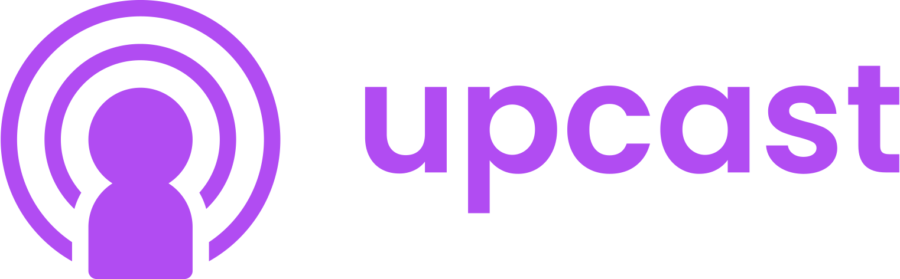
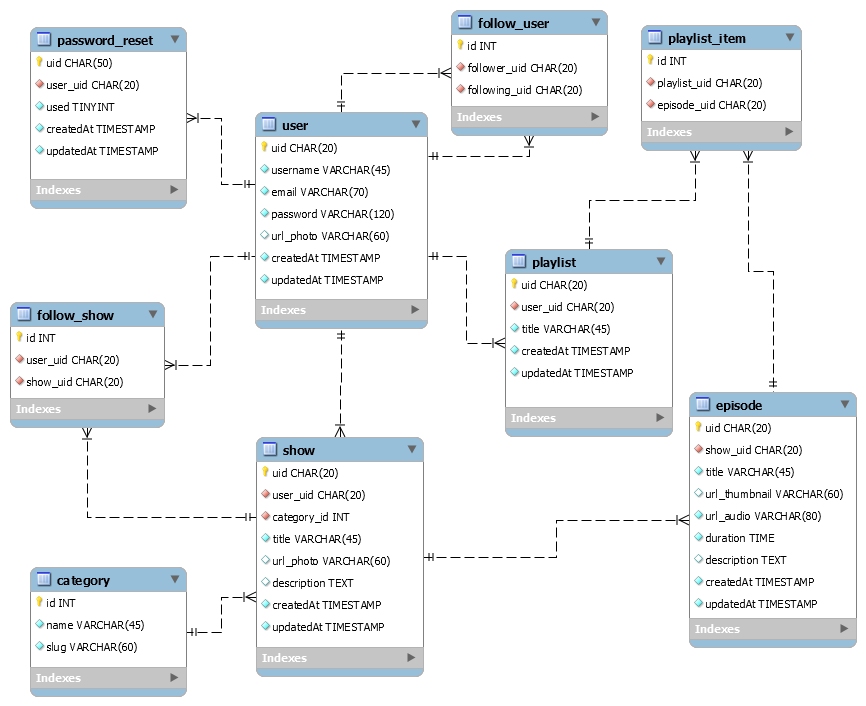

<p align="center">
  
</p>
<br>
<br>

# Upcast
Este repositório faz parte do projeto Upcast, uma plataforma fictícia de podcasts, semelhante ao Spotify e que será utilizada pelo aplicativo web **Upcast**.

## Visão geral
O objetivo principal da API é dar o poder ao usuário de consumir podcasts em forma de áudio, seguir programas, consultar categorias e criar sua lista de reprodução pessoal. Além disso, o usuário poderá personalizar perfis e programas com miniaturas.

## Recursos
- Criar conta de usuário;
- Adicionar miniatura de usuário;
- Gerar autorização com JWT;
- Recuperação de conta com e-mail automático;
- Criar programas de podcasts;
- Adicionar miniatura de programa;
- Criar episódios;
- Enviar arquivos de áudio para episódios;
- Criar playlists e adicionar episódios a ela;
- Pesquisar usuários, programas, categorias, episódios e playlists;
- Encontrar categorias;
- Filtrar programas por categoria;
- Seguir programas;
- HATEOAS "_links".

## Diagrama ER - MySQL


## Instalação
### Pré-requisitos
Para o projeto ser executado, é necessário ter o NodeJS 10+ e MySQL Community 8+ instalados em sua máquina. E para usar o banco de dados, é necessário ter uma conta local.

### Início
**Baixando o repositório**
```
$ git clone https://github.com/willaug/upcast-api.git

$ cd upcast-api
```

**Instalação de dependências**
```
$ npm i
```

### Variáveis de ambiente
Informações sensíveis de banco de dados, e-mails, endereços, chave secreta JWT, período de expiração de autorização, caracteres aceitos em NanoID e porta são configuráveis e estão no arquivo **.env** na pasta raiz.

### Criação do banco de dados
Através do Sequelize ORM é possível executar a criação de banco de dados, migrations e seed através de comandos no terminal. Para criar todo o ambiente necessário e adicionar o usuário principal:

```
$ npx sequelize db:create

$ npx sequelize db:migrate

$ npx sequelize db:seed:all
```

### Executando o servidor
**Para desenvolvimento (Com Nodemon):**
```
$ npm run dev
```

**Para produção:**
```
$ npm run start
```

## Rotas
Para ter maior compatibilidade com diversos aplicativos, todas as respostas possuem **códigos de status HTTP** e **respostas no formato JSON**.

URL base padrão:

### Usuário
- **Obter todos os usuários:**
  - Endpoint: `/users`
  - Método: `GET`
  - Sucesso:
    - Status: `200`;
    - Resposta:
    ```json
      {
        "response": [
          {
            "uid": "S3G9QEqkiTKEdOj0p2ry",
            "username": "Autor anônimo",
            "url_photo": "/images/users/default.svg"
          },
          {
            "uid": "UXfLYYE5BYsH2GwCY392",
            "username": "Upcast Official",
            "url_photo": "/images/users/default.svg"
          }
        ],
        "_links": [
          {
            "href": "http://127.0.0.1:3000/users",
            "rel": "post_create_user",
            "method": "POST"
          }
        ]
      }
    ```
  - Erro:
    - Status: `500`;
    - Resposta:
    ```json
    "Desculpe, mas algum erro ocorreu. Que tal tentar novamente?"
    ```

- **Criar usuário:**
  - Endpoint: `/users`
  - Método: `POST`
  - Sucesso:
    - Status: `201`;
    - Resposta:
    ```json
    {
      "response": "Seja bem-vindo(a) Lorem Ipsum",
      "_links": [
        {
          "href": "http://127.0.0.1:3000/users/GdizGlbWamHjTYRdbbOf",
          "rel": "get_user",
          "method": "GET"
        },
        {
          "href": "http://127.0.0.1:3000/users/GdizGlbWamHjTYRdbbOf/playlists",
          "rel": "get_user_playlists",
          "method": "GET"
        },
        {
          "href": "http://127.0.0.1:3000/users/GdizGlbWamHjTYRdbbOf/shows",
          "rel": "get_user_shows",
          "method": "GET"
        }
      ]
    }
    ```
  - Erro:
    - Status: `400`;
      - Resposta:
      ```json
      [
        "É necessário possuir um nome de usuário",
        "É necessário possuir um e-mail válido",
        "Adicione uma senha de pelo menos 8 caracteres"
      ]
      ```
      ou

      ```json
      "E-mail já existente!"
      ```
    - Status: `500`;
      - Resposta:
      ```json
      "Desculpe, mas algum erro ocorreu. Que tal tentar novamente?"
      ```

- **Obter usuário específico:**
  - Endpoint: `/users/:uid`
  - Parâmetro: `uid`
  - Método: `GET`
  - Sucesso:
    - Status: `200`;
    - Resposta:
    ```json
    {
      "response": {
        "uid": "UXfLYYE5BYsH2GwCY392",
        "username": "Upcast Official",
        "url_photo": "/images/users/default.svg",
        "createdAt": "2021-04-22T15:44:09.000Z"
      },
      "_links": [
        {
          "href": "http://127.0.0.1:3000/users",
          "rel": "get_all_users",
          "method": "GET"
        },
        {
          "href": "http://127.0.0.1:3000/users/UXfLYYE5BYsH2GwCY392/playlists",
          "rel": "get_user_playlists",
          "method": "GET"
        },
        {
          "href": "http://127.0.0.1:3000/users/UXfLYYE5BYsH2GwCY392/shows",
          "rel": "get_user_shows",
          "method": "GET"
        }
      ]
    }
    ```
  - Erro:
    - Status: `400`;
      - Resposta:
      ```json
      "Desculpe, mas a sintaxe está incorreta. Que tal tentar novamente?"
      ```
    - Status: `404`;
      - Resposta:
      ```json
      "Usuário não encontrado."
      ```
    - Status: `500`;
      - Resposta:
      ```json
      "Desculpe, mas algum erro ocorreu. Que tal tentar novamente?"
      ```

- **Obter programas de um usuário específico:**
  - Endpoint: `/users/:uid/shows`
  - Parâmetro: `uid`
  - Método: `GET`
  - Sucesso:
    - Status: `200`;
    - Resposta:
    ```json
    {
      "response": [
        {
          "uid": "UhPETxPfk1MYAMV80am6",
          "title": "MyCAST",
          "description": null,
          "url_photo": "/images/shows/default.svg"
        }
      ],
      "_links": [
        {
          "href": "http://127.0.0.1:3000/users",
          "rel": "get_all_users",
          "method": "GET"
        },
        {
          "href": "http://127.0.0.1:3000/users/UXfLYYE5BYsH2GwCY392",
          "rel": "get_user",
          "method": "GET"
        },
        {
          "href": "http://127.0.0.1:3000/users/UXfLYYE5BYsH2GwCY392/playlists",
          "rel": "get_user_playlists",
          "method": "GET"
        }
      ]
    }
    ```
  - Erro:
    - Status: `400`;
      - Resposta:
      ```json
      "Desculpe, mas a sintaxe está incorreta. Que tal tentar novamente?"
      ```
    - Status: `404`;
      - Resposta:
      ```json
      "Usuário não encontrado."
      ```
    - Status: `500`;
      - Resposta:
      ```json
      "Desculpe, mas algum erro ocorreu. Que tal tentar novamente?"
      ```

- **Obter playlists de um usuário específico:**
  - Endpoint: `/users/:uid/playlists`
  - Parâmetro: `uid`
  - Método: `GET`
  - Sucesso:
    - Status: `200`;
    - Resposta:
    ```json
    {
      "response": [
        {
          "uid": "iRvHq06vbYkNXOA4gbTy",
          "title": "Ouvir enquanto trabalho"
        }
      ],
      "_links": [
        {
          "href": "http://127.0.0.1:3000/users",
          "rel": "get_all_users",
          "method": "GET"
        },
        {
          "href": "http://127.0.0.1:3000/users/UXfLYYE5BYsH2GwCY392",
          "rel": "get_user",
          "method": "GET"
        },
        {
          "href": "http://127.0.0.1:3000/users/UXfLYYE5BYsH2GwCY392/shows",
          "rel": "get_user_shows",
          "method": "GET"
        }
      ]
    }
    ```
  - Erro:
    - Status: `400`;
      - Resposta:
      ```json
      "Desculpe, mas a sintaxe está incorreta. Que tal tentar novamente?"
      ```
    - Status: `404`;
      - Resposta:
      ```json
      "Usuário não encontrado."
      ```
    - Status: `500`;
      - Resposta:
      ```json
      "Desculpe, mas algum erro ocorreu. Que tal tentar novamente?"
      ```